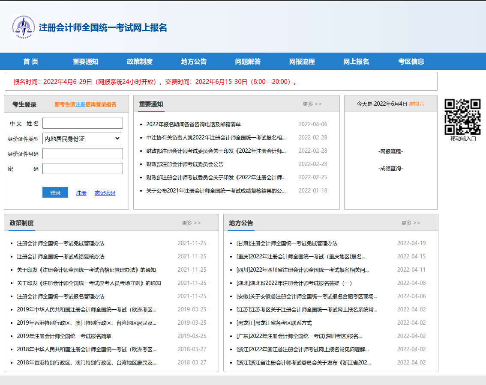

#### 1.website of application
[注册会计师全国统一考试网上报名](https://cpaexam.cicpa.org.cn)

#### 2.about the test itself
`会计` > `审计` > `财务成本管理` > `税法` > `经济法` > `公司战略与风险管理`

#### 3.translation
| 词汇               | 翻译                                   |
|--------------------|----------------------------------------|
| 会计               | accounting                             |
| 财务成本管理       | financial and cost accounting          |
| 税法               | tax law                                |
| 审计               | audit                                  |
| 公司战略与风险管理 | corporate strategy and risk management |
| 经济法             | economic law                           |
